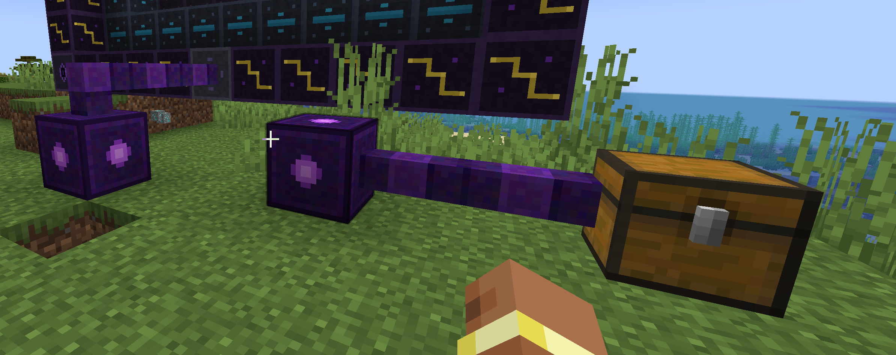

# Void Miner

**Tier**: 4 — Automated Resource Generation
**Type**: Single-block machine
**Category**: Resource Generation

---

## Overview

The Void Miner rips resources from the dimensional void using massive amounts of RF energy. It generates random ores and materials without needing to mine — the ultimate late-game resource solution. Consumes Exotic Matter as a dimensional catalyst.

---

## Specifications

| Property | Value |
|----------|-------|
| Energy Consumption | 5,000 RF/t |
| Internal Buffer | 2,000,000 RF |
| Cycle Time | 400 ticks (20 seconds) per item |
| Catalyst | 1 Exotic Matter per 10 cycles (consumed) |
| Output Slots | 6 (main output buffer) |
| Filter Slot | 1 (optional focus item) |
| Hardness/Resistance | 8.0 / 12.0 |
| Tool | Pickaxe (diamond+) |

---

## Output Table

### Default Drop Table (No Focus)

| Category | Items | Weight |
|----------|-------|--------|
| Common Ores | Raw Iron, Raw Copper, Raw Gold | 40% |
| Mod Ores | Raw Titanium, Raw Tungsten, Raw Lithium, Raw Thorium | 30% |
| Gems | Diamond, Emerald, Amethyst Shard, Lapis Lazuli | 15% |
| Rare | Tachyon Shard, Glowstone Dust, Redstone | 10% |
| Ultra Rare | Nether Star fragment, Ancient Debris | 5% |

### Focus System
Place a "focus" item in the filter slot to bias output:
- **Iron Ingot in filter**: 70% iron-related drops, 30% random
- **Diamond in filter**: 70% gem drops, 30% random
- **Tachyon Shard in filter**: 70% mod material drops, 30% random
- **Exotic Matter in filter**: 50% rare+ drops, 50% random (consumes exotic matter 2x faster)

*Focus doesn't guarantee specific items — it shifts the probability distribution toward that category.*

---

## GUI Layout

```
┌──────────────────────────────────────────────────┐
│               Void Miner                         │
│                                                  │
│  [Energy]  [Catalyst]  [Focus]     [Output x6]   │
│   ██████    ┌──┐        ┌──┐      ┌──┬──┬──┐   │
│   ██████    │EM│        │  │      │  │  │  │   │
│   ██████    └──┘        └──┘      ├──┼──┼──┤   │
│   ██████                          │  │  │  │   │
│   ██████   EM: 7/10     ──►      └──┴──┴──┘   │
│            cycles left  Progress                 │
│                                                  │
│  ┌──────────────────────────────────────┐        │
│  │     Player Inventory                 │        │
│  └──────────────────────────────────────┘        │
└──────────────────────────────────────────────────┘
```

---

## ContainerData (6 slots)

| Index | Data |
|-------|------|
| 0 | progress (ticks) |
| 1 | maxProgress (400) |
| 2 | energy stored |
| 3 | energy capacity |
| 4 | catalyst cycles remaining (0-10) |
| 5 | focus mode (0=none, 1-4=categories) |

---

## Behavior

### Catalyst System
- Each Exotic Matter fuels 10 mining cycles
- Auto-consumes from catalyst slot when cycles reach 0
- Won't operate without catalyst
- Shows cycles remaining in GUI

### Processing
- 400-tick cycle → produces 1-3 items based on weighted random
- Output goes to first available slot in 6-slot buffer
- Stops if all output slots full
- Pauses without power (progress preserved)

### Dimensional Effects
- Works in any dimension
- Nether: +20% chance of nether materials (quartz, netherrack, ancient debris)
- End: +20% chance of ender materials (ender pearls, end stone, shulker shells)
- Overworld: Default table

---

## Visual

- **Blockstate**: `ACTIVE` boolean
  - `active=true`: Swirling void portal effect on top, purple/black particles, light level 3
  - `active=false`: Dark, dormant
- Particle: Enderman-like particles falling into the block from above
- Sound: Deep dimensional tearing sound, pulsing

---

## Crafting Recipe

```
[Exotic Matter]   [Tachyon Alloy]    [Exotic Matter]
[Tachyon Alloy]   [Ender Chest]      [Tachyon Alloy]
[Reactor Plating] [Quantum Processor] [Reactor Plating]
```

---

## Automation

- Top: Catalyst insertion
- Sides: Focus item insertion
- Bottom: Output extraction
- Energy from all sides

---

## Implementation Notes

### New Files
- `block/VoidMinerBlock.java`
- `block/entity/VoidMinerBlockEntity.java`
- `menu/VoidMinerMenu.java`
- `screen/VoidMinerScreen.java`

### Technical Details
- Loot table implementation: Use weighted random lists
- Focus system: Modify weights based on filter slot contents
- Dimension check: `level.dimension()` for bonus drops
- Catalyst tracking: Simple counter in NBT, decremented each cycle
